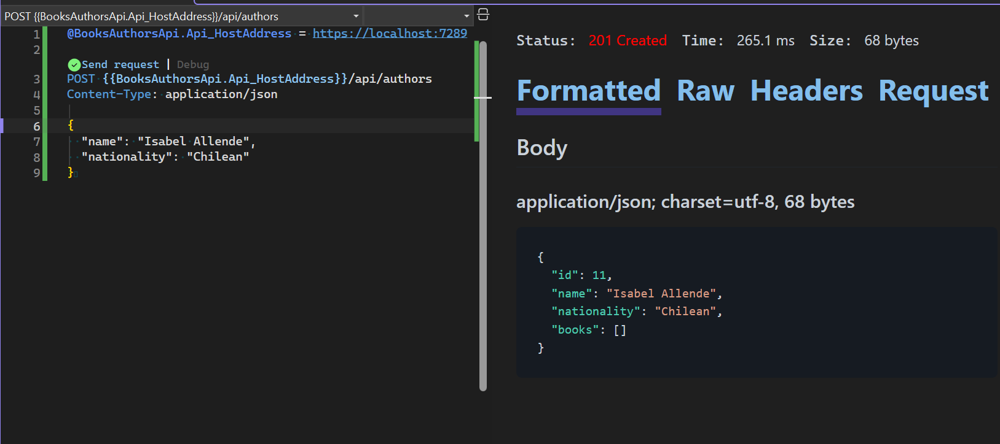

# Books and Authors API

A RESTful Web API built with **ASP.NET Core 10** demonstrating the **Model-View-Controller (MVC)** architectural pattern. 

## 🏗️ Architecture & Engineering Principles
This project follows a 4-tier layered architecture to ensure a clean **Separation of Concerns**, mimicking professional Enterprise patterns:

* **Controllers**: Entry points handling HTTP traffic and status codes.
* **Services**: Data orchestration, business logic, and "Hydration" (joining related objects).
* **Models (Data Access)**: Repository-style layer managing file I/O and **Referential Integrity**.
* **Resources**: Persistent JSON storage.

### Key Features
* **Referential Integrity**: Prevents "orphan" books by validating `AuthorId` during creation.
* **Cascade Delete**: Automatically purges all associated books when an Author is deleted to maintain a clean data store.
* **Bi-directional Hydration**: Automatically maps relationships so that Books include Author details, and Authors include their collection of Books.

## 🛠️ Tech Stack
* **.NET 10.0** (The latest LTS release)
* **ASP.NET Core Web API**
* **C# 14**
* **LINQ** for advanced data querying and filtering.
* **System.Text.Json** for high-performance serialisation.

## 🚀 Getting Started

### Prerequisites
* Visual Studio 2026
* .NET 10 SDK
* PowerShell 7+

### Installation & Run
1. Clone the repository:
   ```powershell
   git clone [https://github.com/khalosmoscato/BooksAuthorsApi.git](https://github.com/khalosmoscato/BooksAuthorsApi.git)
   ```
2. Navigate to the project directory:
   ```powershell
   cd cs-mvc-books-authors
   ```
3. Restore dependencies and run the application:
   ```powershell
   dotnet restore
   dotnet run --project BooksAuthorsApi.Api
   ```

## 🛤️ API Endpoints

### ✍️ Authors
| Method | Endpoint | Description |
| :--- | :--- | :--- |
| `GET` | `/api/authors` | List all authors (Includes nested books) |
| `GET` | `/api/authors/{id}` | Get author by ID (Includes nested books) |
| `POST` | `/api/authors` | Create a new author |
| `DELETE` | `/api/authors/{id}` | Delete author (Triggers **Cascade Delete** on books) |

### 📚 Books
| Method | Endpoint | Description |
| :--- | :--- | :--- |
| `GET` | `/api/books` | List all books (Includes Author details) |
| `GET` | `/api/books/{id}` | Get book by ID (Includes Author details) |
| `GET` | `/api/books/author/{id}` | Get all books by a specific Author |
| `POST` | `/api/books` | Create a book (Validates Author existence) |
| `DELETE` | `/api/books/{id}` | Delete a specific book |

## ✅ Testing
To ensure reliability, endpoints are tested directly within **Visual Studio 2026** using the **Endpoints Explorer** and `.http` files. This allows for rapid verification of HTTP status codes and JSON response bodies.



### Authors
- `GET /api/authors` - Retrieve all authors with basic details.
- `GET /api/authors/{id}` - Retrieve a specific author by their unique ID.
- `POST /api/authors` - Add a new author to the system.
- `DELETE /api/authors/{id}` - Remove an author from the records.

### Books
- `GET /api/books` - Retrieve all books including associated author details.
- `GET /api/books/{id}` - Retrieve a specific book by its ID.
- `POST /api/books` - Add a new book (includes validation of AuthorId).
- `DELETE /api/books/{id}` - Remove a book from the records.
- `GET /api/books/author/{authorId}` - Retrieve all books written by a specific author.

## 🏛️ Project Structure
The solution is organised into distinct layers to demonstrate MVC principles:
- **Controllers**: Entry points for HTTP traffic.
- **Services**: Domain-specific logic and data orchestration.
- **Models**: Data definitions and repository-style JSON access.
- **Resources**: Persistent storage using JSON files.

## 📄 License
This project is for educational purposes as part of the software engineering bootcamp curriculum.